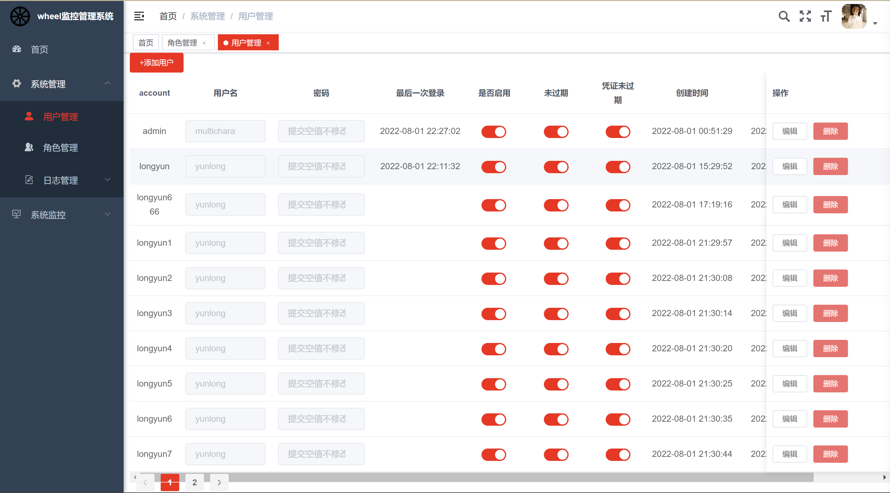
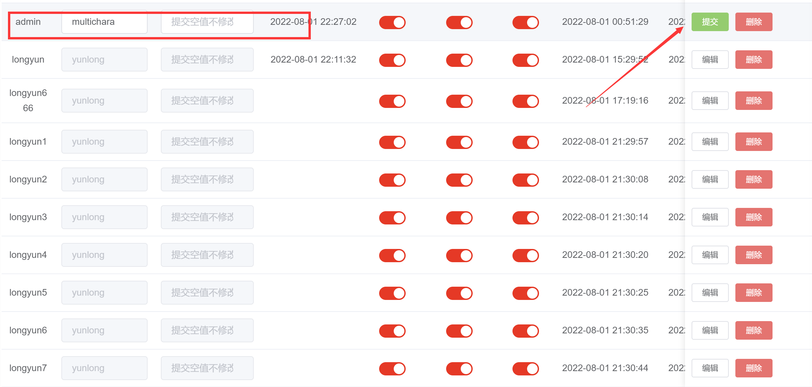
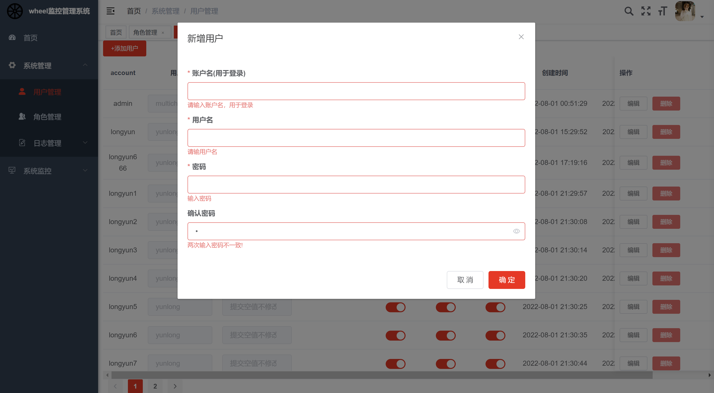
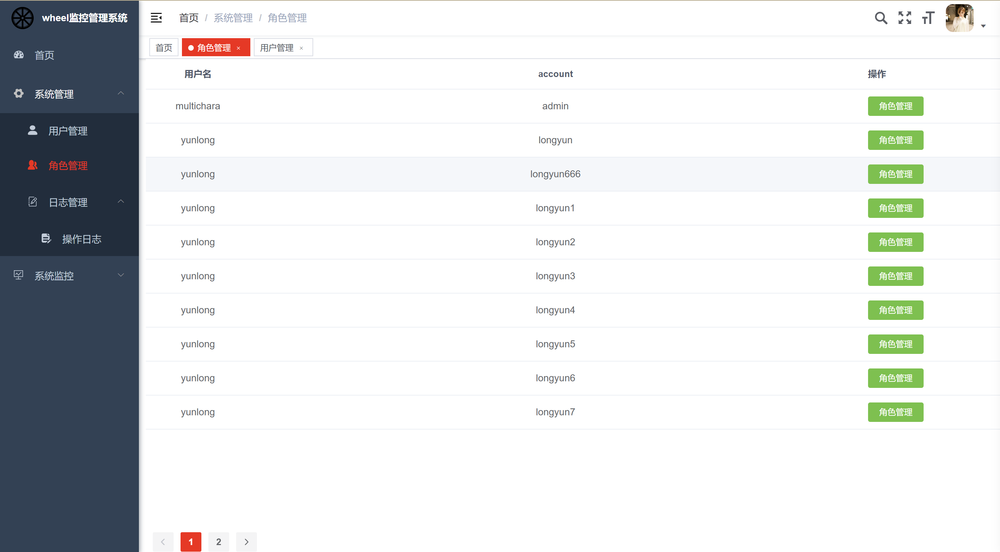
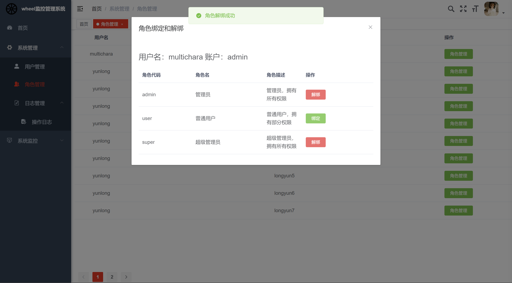
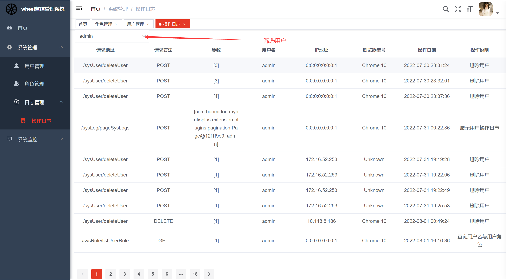
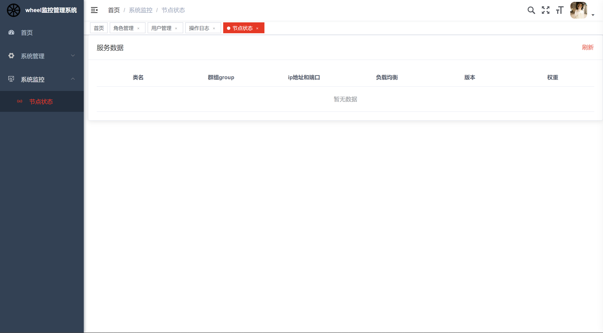

# wheel-admin-ui

## 项目简介
这是一个基于 ruoyi-vue 的项目, 是一个管理监控 zookeeper 节点信息的系统。
此项目开发坚持一切从简的原则

## 技术栈
Vue2 + ElementUI + axios

## 项目启动
命令行运行
`npm run dev`

## 功能模块
### 用户管理
包括系统用户的增删改查，一切尽量做到简介

**编辑模式**

**新增用户**

### 角色管理
主要是对于每一个当前用户创建的用户的角色绑定和解绑

**角色绑定与解绑**

### 日志模块
主要是对当前用户以及当前用户创建的用户的日志的查看

### 节点监控模块
查看节点的服务

